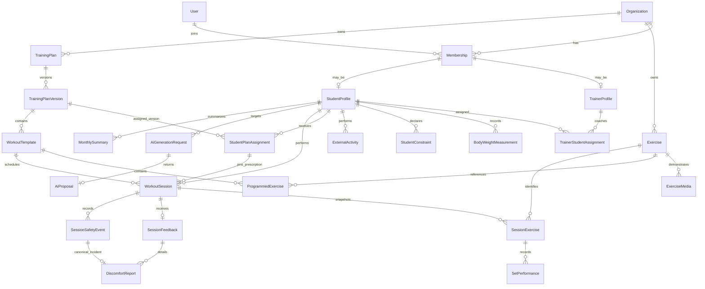

# Domain and Data Model

## 1. Ubiquitous Language

| Term | Definition |
| --- | --- |
| Organization | Security and data boundary for one trainer workspace at launch; team support is deferred. |
| Membership | A user's role inside an organization. |
| Trainer assignment | The authorization relationship allowing a trainer to coach a student. |
| Student profile | Persistent planning context for one student; not a workout record. |
| Constraint | A student-declared limitation, injury, or recurring discomfort that must inform planning. It is not a diagnosis. |
| Exercise | Reusable approved movement from the exercise library. |
| Training plan | Programa reusable de la organización; no pertenece a un alumno. `StudentPlanAssignment` vincula al alumno con una versión publicada concreta. |
| Plan version | Mutable draft or immutable published snapshot of a plan's workout templates. |
| Workout template | Reusable prescribed workout inside one plan version. |
| Programmed exercise | Ordered exercise prescription inside a workout template. |
| Workout session | One scheduled occurrence that the student can execute. |
| Session exercise | Snapshot of one programmed exercise for a specific workout session. |
| Set performance | Actual result for one set; the source of truth for performance statistics. |
| Session feedback | Structured student response after a finalized workout. |
| AI generation request | Auditable request to create a proposal from a controlled context snapshot. |
| AI proposal | Validated suggestion that has no effect until a trainer applies it to a draft. |
| Monthly summary | Versioned deterministic metrics plus an optional AI-authored narrative tied to those metrics. |

Avoid the legacy term `Routine` because it ambiguously described a template, generated artifact, assignment, and completed workout.

## 2. Bounded Contexts

### Identity and Access

Owns users, credentials, opaque sessions, organization membership, student invitations, and audit actor identity.

### Coaching

Owns trainer profiles, student profiles, trainer-student assignments, goals, availability, body-weight measurements, constraints, external activities, and trainer notes.

### Exercise Catalog

Owns exercises, muscles, equipment, instructions, media, licensing metadata, active state, and AI eligibility.

### Programming

Owns training plans, plan versions, workout templates, programmed exercises, publishing, and scheduling intent.

### Workout Execution

Owns scheduled workout sessions, prescription snapshots, set performance, lifecycle transitions, partial/cancellation reasons, and finalization locks.

### Feedback and Safety Signals

Owns structured session feedback and canonical session safety events. It exposes factual signals and never a medical diagnosis.

### Analytics

Reads finalized execution, feedback, and measurements. It calculates reproducible metrics and monthly snapshots but does not own source facts.

### AI Assistance

Owns generation requests, minimized context snapshots, provider interactions, output validation, proposals, review status, and model observability. It cannot write into other contexts except through explicit application commands after trainer action.

## 3. Aggregate Boundaries and Invariants

### Organization aggregate

- Every protected record is organization-scoped directly or through a required parent.
- Cross-tenant parent combinations are rejected by composite foreign keys or equivalent database constraints, not application convention alone.
- Organization access is always derived from the authenticated membership, never a request-body organization ID.
- A disabled membership cannot authenticate into that organization.
- Launch creates one organization per trainer-owner account. Organization switching, teams, trainer invitations, and granular permission grants are not v1 features.
- The opaque authentication session is bound to one active membership/workspace. The launch owner has one `ADMIN` membership, an associated trainer profile, and inherits trainer capabilities.

### Student profile aggregate

- A student profile is organization-scoped and may exist without a membership while its invitation is pending. Acceptance attaches exactly one student membership; an attached profile and membership must share the organization.
- A profile may be incomplete before invitation acceptance. Un plan reusable puede publicarse sin alumno; la revisión de la ficha es un requisito de contexto para futuras decisiones individualizadas e IA, no para publicar un plan genérico.
- Readiness stores the confirming membership and timestamp; relevant profile/constraint changes atomically reset it to incomplete.
- Readiness is valid only when `reviewedPlanningRevision` equals the current `planningRevision`; readiness-relevant parent or child changes increment the planning revision.
- Current weight is derived from the latest measurement; it is not an independently editable duplicate.
- Measurements are append-only; corrections create an audited replacement or correction event.
- Measurement replacement stays within the same student, requires a reason, cannot branch or cycle, and never updates/deletes the original.
- Active constraints must be included in planning context.
- Trainer notes are a separate access-controlled entity and are never sent to AI by default.

### Exercise aggregate

- Every v1 exercise is organization-owned and its slug is unique inside that organization. Seed exercises are copied into the new workspace.
- Phase 2 confirms organization-owned rather than globally editable exercises: the trainer may edit only their workspace catalog, so another organization cannot silently inherit that edit. The same curated definitions are seeded as separate IDs per organization. Future plans and AI must reference an exercise's canonical ID within that organization.
- A structured muscle/equipment/pattern taxonomy plus normalized accent-insensitive name/alias search supports filtering now and a visual muscle map later without splitting exercise identity into free text.
- Inactivation prevents future programming but does not break history.
- AI output may reference only active, `aiEligible` exercises.
- Media cannot be published without source/license metadata and verification state. Phase 2 media paths are restricted to bundled original illustrations; additional third-party media requires a separate rights/verification design.

### Training plan aggregate

- An organization owns reusable plan identities. `StudentPlanAssignment` binds a student to one immutable published version and retains previous assignments when a trainer replaces the active one.
- Only one plan version may be `ACTIVE` for a plan and only one primary assignment may be active for a student at a time.
- At most one draft exists per plan. Version numbers are unique and allocated while the plan is locked.
- Draft versions are mutable by authorized trainers.
- Active versions are immutable.
- Editing an active version creates the next draft version.
- Workout and exercise ordering is unique within the parent.
- A canonical exercise appears at most once in a workout template, making previous-performance matching unambiguous.
- Minimum repetitions cannot exceed maximum repetitions.
- Intensity mode is `RIR`, `RPE`, or `NONE`; only the matching target field may be populated.
- Suggested load is optional guidance and is never copied into actual set performance.
- New assignments require active versions. Phase 4 sessions scheduled for an existing assignment may use that pinned, previously published version after it retires.
- Publishing snapshots the exercise catalog fields needed for stable prescription, safety review, instructions, and load-entry interpretation.
- Publish verifies those catalog snapshots are exact copies of the referenced exercise version; scheduling copies each programmed exercise and prescription exactly once into the immutable session snapshot.
- Publishing a replacement version does not move existing student assignments; the trainer replaces the assignment explicitly. Already scheduled Phase 4 sessions remain bound to their source version unless separately rescheduled.
- Plan identity moves `DRAFT -> ACTIVE -> ARCHIVED`, or `DRAFT -> ARCHIVED` after voiding its draft. Archiving requires no active assignments or unfinished draft; it retires an active version and does not delete history.

### Workout session aggregate

- `WorkoutSession` is the scheduled occurrence and its execution parent. It belongs to one student, organization, assignment-pinned version and workout template. The assignment may subsequently end or its version retire without changing the occurrence.
- The student may start only their own `NOT_STARTED` session.
- Scheduling atomically copies and seals the prescription, technique text and exact numbered empty sets. Start is idempotent and changes only the occurrence state/start time.
- Actual performance can change only while the session is `IN_PROGRESS`.
- The student cannot change snapshot prescription fields.
- Each session exercise has exactly the programmed set positions.
- Finalization status is computed by the server, not accepted from the client.
- Finishing early for discomfort or feeling unwell atomically creates a minimal typed safety event even when detailed feedback is not submitted.
- `COMPLETED`, `PARTIAL`, `CANCELLED`, and trainer-marked `SKIPPED` are terminal for student writes. `PARTIAL` requires a structured reason. A draft set value is not completed work until the student explicitly marks it complete.
- A finalized session is not hard-deleted.
- Historical analytics use actual completed set fields only.
- Previous performance is the latest `COMPLETED` or `PARTIAL` session for the same student and canonical exercise with at least one completed set and `finishedAt < currentSession.startedAt`, ordered by `finishedAt DESC, id DESC`.

### Feedback aggregate

Phase 5 implements one immutable `SessionFeedback` per finalized `COMPLETED`/`PARTIAL` workout within 24 hours. `DiscomfortReport` stores one region/intensity per feedback with an optional exercise ID. It links to exactly one canonical `SessionSafetyEvent`; the Phase 4 early discomfort event is reused instead of duplicated. Phase 4 itself collected the early fact without a feedback record.

- Feedback belongs to exactly one finalized `COMPLETED` or `PARTIAL` session.
- A student can submit one feedback record per session within the configured window.
- `SessionSafetyEvent` is the canonical source for discomfort/feeling-unwell incidents. Early finish may create it without detail; a Phase 5 feedback report references the same immutable row and supplies the additional structured detail. Additional locations create feedback-source safety events linked to one report each.
- Workout Execution owns the early event. Feedback owns the immutable feedback/report rows and inserts only validated `SESSION_FEEDBACK` events; it does not update Phase 4 terminal rows or the original early event.
- Feedback with `discomfortPresent=true` must have at least one region/intensity report and no duplicate region. Feedback with `discomfortPresent=false` has none and cannot contradict a previously recorded early discomfort event.
- `sessionRpe` measures student-reported workout effort, `perceivedState` overall workout feeling, and `recoveryState` recovery felt on arrival; none is calculated from weight or interpreted as a diagnosis.
- Safety events cannot be converted into diagnoses or causal injury claims.

### Historical correction aggregate

- Finalized `SetPerformance` rows remain immutable.
- An authorized correction is a typed full replacement snapshot with monotonically increasing revision, actor, reason, and timestamp.
- The replacement includes completion timestamp/state and all actual intensity fields; it must still satisfy the terminal session's completion invariant.
- Analytics and previous-performance queries read the latest correction revision when present; otherwise they read the original set.
- Correction creation and analytics invalidation/recalculation metadata are committed together.

### AI generation aggregate

- Context is built by application services from allowlisted fields.
- The provider never receives credentials, arbitrary trainer notes, direct database access, or unrestricted identifiers.
- Provider output is untrusted until schema, catalog, range, and deterministic rule validation pass.
- A proposal cannot activate or mutate a plan.
- Applying a proposal creates or updates a draft only after explicit trainer action.
- Provider retries are idempotent and cannot create duplicate proposals.

## 4. Entity Relationship Overview



## 5. State Machines

### Plan version

```text
DRAFT -> ACTIVE -> RETIRED
  |
  +-> VOID
```

Rules:

- `DRAFT -> ACTIVE` is the trainer's publish/approval action and requires validation. Plans are independent of student profiles, so profile readiness is evaluated for future student-specific decisions, not for publishing a reusable program.
- Publishing records actor/time and retires the previously active version in one transaction.
- `ACTIVE` content never returns to `DRAFT`.
- Existing assignments remain pinned to their source published version after it retires. A future session may be scheduled from that still-current assignment; no new student can be assigned directly to a retired version.
- `VOID` and all published states are immutable; only lifecycle metadata may change during an allowed transition.

| From | Command | Actor | To | Required effects |
| --- | --- | --- | --- | --- |
| `DRAFT` | Publish | Organization Trainer/Admin | `ACTIVE` | Validate prescriptions and catalog snapshots; record publisher/time; retire prior active version |
| `ACTIVE` | Retire | Organization Trainer/Admin | `RETIRED` | Stop new assignments; preserve existing assignments and later sessions |
| `DRAFT` | Void | Organization Trainer/Admin | `VOID` | Record reason; no new assignment |

### Workout session

```text
NOT_STARTED -> IN_PROGRESS -> COMPLETED
                           -> PARTIAL
                           -> CANCELLED
 NOT_STARTED ----------------> CANCELLED
 NOT_STARTED ----------------> SKIPPED
```

Rules:

- `COMPLETED` requires every required set to be complete.
- Finish with missing required sets yields `PARTIAL` with a required structured reason, regardless of requested client status.
- `CANCELLED` is allowed only when zero sets are complete; otherwise ending the session produces `PARTIAL` or `COMPLETED`.
- Terminal transitions record timestamp, actor, reason, and optimistic-lock version.
- `SKIPPED` is a trainer/admin decision on a past-due never-started occurrence; no automatic expiration job exists.

| From | Command | Actor | To | Required effects |
| --- | --- | --- | --- | --- |
| `NOT_STARTED` | Start | Owning Student | `IN_PROGRESS` | Check due date and sealed snapshots; set startedAt idempotently |
| `NOT_STARTED` | Cancel | Owning Student or assigned Trainer/Admin/System | `CANCELLED` | Record actor/reason; optional audited excuse later |
| `IN_PROGRESS` | Finish | Owning Student | `COMPLETED` or `PARTIAL` | Server computes status; preserve sets; create safety event when needed |
| `IN_PROGRESS` | Cancel | Owning Student or assigned Trainer/Admin/System | `CANCELLED` | Allowed only when zero sets are `COMPLETED`; otherwise use Finish and produce `PARTIAL` |
| `NOT_STARTED` | Mark skipped | Assigned Trainer/Admin | `SKIPPED` | Past-due date only; preserve empty execution facts |

### AI request and proposal

```text
QUEUED -> BUILDING_CONTEXT -> GENERATING -> VALIDATING -> READY
   |             |                |             |
   +-----------> FAILED <----------+-------------+

Proposal: READY -> APPLIED_TO_DRAFT
                -> REJECTED
                -> EXPIRED
```

`READY` means technically valid, not trainer-approved.

Generation requests can move to `CANCELLED` from `QUEUED`, `BUILDING_CONTEXT`, or `GENERATING`. The worker checks cancellation before persistence and discards late provider output. `READY`, `FAILED`, and `CANCELLED` are terminal request states.

## 6. Data Classification

| Classification | Examples | Handling |
| --- | --- | --- |
| Public/catalog | Exercise name, instructions, licensed media attribution | Organization-readable; media license still enforced |
| Internal | Plan rationale, operational job status | Authorized organization staff only |
| Personal | Name, email, birth date, height, workout history | Object-level access, encryption in transit and at rest |
| Sensitive wellness | Declared injury, limitations, discomfort location/intensity | Minimize access, audit reads/changes where practical, exclude from logs |
| Secret | Password hash, opaque session token hash, provider key | Never returned; secret manager; rotation policy |

## 7. Deletion and Historical Integrity

- Normal product actions archive or deactivate; they do not cascade-delete workout history.
- Closing a student relationship revokes access and stops scheduling while retaining records according to policy.
- Account erasure is a dedicated privacy workflow that either deletes or irreversibly anonymizes records according to legal obligations and configured retention.
- Audit logs and finalized sessions are append-only from normal application paths.
- Exercise and plan references retain snapshots so archived source entities do not alter historical display.
- PostgreSQL triggers reject normal updates to active plan content, session snapshots, finalized performed sets, audit rows, and correction revisions.

## 8. Proposed Database Model

The concrete proposal is in [`prisma/schema.prisma`](prisma/schema.prisma). It is intentionally a review artifact, not an applied migration.

Notable database choices:

- CUID2-style string IDs are assumed for application portability; UUIDv7 is also acceptable if standardized before implementation.
- PostgreSQL `Decimal` stores kilograms and loads; JavaScript floating-point values must not be persisted directly.
- `DateTime` values are UTC instants. Scheduling uses the student's timezone when present, otherwise the organization timezone, and snapshots that IANA timezone on each session/report so later preference changes do not rewrite history.
- `version` fields support optimistic concurrency for mutable drafts and active sessions.
- Compound uniqueness enforces ordering and one set row per position.
- Composite organization keys prevent cross-tenant parent relationships for core coaching records. Authorization still requires organization-scoped application queries and integration tests.

SQL migrations must supplement Prisma with constraints it cannot fully express:

- one active and at most one draft plan version per reusable plan, plus one active primary plan assignment per student;
- at most one in-progress session per student;
- at most one active trainer-student assignment for a pair;
- valid set/repetition/rest/RIR/RPE/intensity ranges and mutually exclusive intensity fields;
- valid feedback/discomfort ranges;
- required actual values for a completed set according to exercise performance mode;
- lifecycle timestamp/reason consistency for every status;
- cross-parent lineage from assignment to same-organization student/plan/version; Phase 4 session to pinned assignment/template and session exercise to programmed exercise;
- immutability rules for active plans and finalized execution.

## 9. Deterministic Derived Data

Do not persist values that are cheap and safe to derive, such as current age, current weight, workout completion percentage, or arbitrary “history window size.” Persist monthly snapshots only when reproducibility or reporting performance warrants it. Every snapshot stores metric definition version and source period.

## 10. Legacy Concepts Deliberately Rejected

- A generated routine is not a workout session.
- An exercise prescription is not the canonical exercise catalog entry.
- A single text field is not sufficient for set performance.
- A free-text session report is not sufficient for analytics or safety signals.
- Client-provided student IDs do not establish ownership.
- A mutable `windowSize` is not a domain fact.
- n8n callbacks are not the AI domain boundary.
