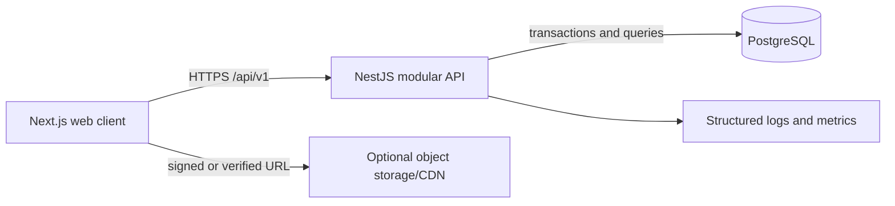
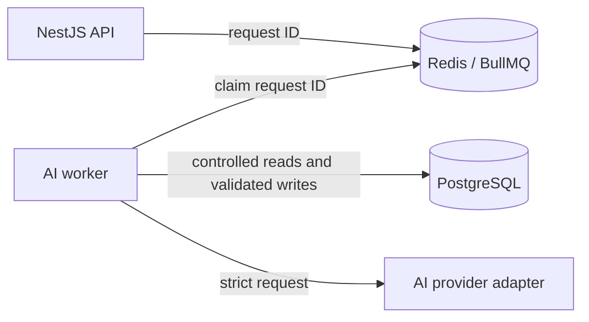

# System Architecture

## 1. Architecture Decision

Machi Gym usa un monolito modular TypeScript:

- `apps/web`: Next.js responsive web application;
- `apps/api`: NestJS REST API with business modules;
- PostgreSQL: transactional source of truth;
- optional object storage/CDN: verified exercise media.

Redis, BullMQ, and a separate worker are added in the AI phase, when the first durable long-running external job exists. A transactional outbox is added only if notifications or external webhooks require guaranteed post-commit delivery. n8n remains an optional outbound consumer and never participates in core state transitions.

Launch tenancy is deliberately shallow: one workspace per trainer-owner account. `Organization` remains the data boundary so tenant scoping is not retrofitted later, but organization switching, teams, granular permission grants, and trainer invitations are deferred.

## 2. Runtime Topology

Initial runtime:



AI phase addition:



Only the web edge and API are public. PostgreSQL, and later Redis, remain private. AI availability never affects manual planning or workout execution.

## 3. Repository Shape

```text
machi-gym-app-v2/
  apps/
    web/
    api/
  packages/
    contracts/   # contratos de transporte Zod y enums; único paquete compartido actual
  docs/
  apps/web/e2e/  # tests Playwright existentes
  docker-compose.yml
```

`apps/web`, `apps/api` y `packages/contracts` son los paquetes actuales. Añadir `ui`/`config` compartidos sólo con consumidores reales. `apps/worker` y `packages/ai` son propuestas futuras, no directorios presentes. No crear capas genéricas de repositorios, buses o entidades espejadas sin necesidad demostrada.

Constraints:

- UI never imports Prisma/database types.
- `contracts` contains strict transport contracts, not persistence models.
- Controllers authenticate, parse, authorize, and delegate; business rules live in module services and pure policy functions.
- Prisma access stays inside the owning Nest module through explicit queries and transaction functions.
- Introduce interfaces only at actual external boundaries such as AI providers and object storage.
- Prisma records are mapped to explicit response projections.

## 4. Backend Module Boundaries

| Module | Owns |
| --- | --- |
| `auth` | users, opaque server sessions, password reset, MFA policy |
| `organizations` | launch workspace and owner membership |
| `trainers` | trainer profile and student assignments |
| `students` | profile, readiness, goals, availability, activity, measurements, constraints, trainer notes |
| `exercises` | organization exercise catalog and verified media |
| `training-plans` | reusable organization plans, immutable versions, templates, prescriptions, publishing, and version-pinned student assignments |
| `workout-sessions` | scheduling, lifecycle, immutable snapshots, actual sets, canonical early safety events |
| `feedback` | one-shot session feedback, relational discomfort detail, eligibility and small descriptive trainer signals; appends validated feedback-source safety events in the same scoped transaction |
| `analytics` | deterministic metric functions and screen queries |
| `ai` | context building, generation jobs, provider adapter, validation, proposals; added later |
| `reports` | monthly metric snapshots and rendered narrative; added later |
| `notifications` | optional outbound delivery; added later |

Module services may call another module's public application function. They must not update another module's tables through an unscoped Prisma call.

Phase 5 feedback transactions enforce student/session/organization lineage at the service and composite-FK/trigger layers. A feedback-source canonical safety event is inserted in the feedback submission transaction and linked to exactly one discomfort detail row. Early-finish events remain immutable. Neither source is inferred from free text.

## 5. Module Shape

Use the smallest structure that keeps rules testable:

```text
module/
  controller.ts
  service.ts
  queries.ts
  policies.ts
  schemas.ts
```

Split further only when a file has multiple responsibilities. Pure lifecycle and analytics functions must not import NestJS or Prisma. Generic repositories and mirrored persistence/domain entities are explicitly out of scope for v1.

## 6. Core Transaction Flows

### Schedule workout occurrence (Phase 4)

1. Authorize the assigned trainer/admin and lock the student.
2. Resolve the student's current assignment, its pinned published version (which may now be `RETIRED`), and a template of that version. Validate explicit local date against the assignment period.
3. Create a `WorkoutSession` in `NOT_STARTED` with student, assignment, version, template, date/timezone, and scoped retry key.
4. Copy every immutable `SessionExercise` prescription/technique snapshot and exact empty `SetPerformance` positions from the published source in the same transaction.
5. Seal the snapshot before commit. Database lineage/copy triggers reject missing, extra or altered prescriptions and unsealed occurrences.

The API selects the student's due or next session; templates remain independent of weekdays. Available weekdays are scheduling guidance only.

### Start workout

1. Authenticate the student through an opaque server session.
2. Query the session by ID, active membership, student ownership, and `NOT_STARTED` status in one authorization-aware operation.
3. Verify the scheduled occurrence already contains a sealed immutable copy of its assignment-pinned template. The assignment may have since changed; the occurrence remains valid.
4. Set session `IN_PROGRESS`, `startedAt`, and increment session version under the common session row lock.
5. Commit atomically and return an execution projection with prescribed snapshots, current actuals, technique metadata, and batched previous finalized performance.

Retrying start returns the same in-progress snapshot.

### Save a performed set

1. Authenticate and query through session ownership.
2. Lock the parent session row and require `IN_PROGRESS`; start, save, finish, and cancel all acquire this same lock before evaluating state.
3. Parse a student-only DTO containing `actualLoadKg`, `actualRepetitions`, selected RIR/RPE field, completion state, and set version.
4. Update only that `SetPerformance` row using its own optimistic version.
5. Return the new set version and saved timestamp.

The `PUT` shape plus set version makes the operation conflict-safe. An exact replay may return the already-saved representation when the submitted values match; otherwise a stale version returns `409`. Session version is not changed for ordinary set saves. No generic idempotency record or per-save audit event is required.

### Finish workout

1. Lock the in-progress session.
2. Read server-owned set states.
3. Compute `COMPLETED` only when every required set is complete; otherwise compute `PARTIAL`.
4. Require one quick structured partial reason when work remains; optional detail/location never blocks urgent exit.
5. If discomfort or feeling unwell is selected, create or update the canonical typed session safety event without blocking urgent exit for missing detail.
6. Set terminal status and `finishedAt` atomically.
7. Return the feedback route, canonical safety-event reference, and current history summary.

Cancellation is allowed only when zero sets are complete. Once one set is complete, ending the session uses the finish flow and produces `PARTIAL` unless all required sets are complete.

### Publish plan version

1. Authorize a Trainer/Admin in the plan's organization. The plan is reusable and may have no student yet.
2. Validate non-empty templates, same-organization active exercises, prescription ranges and mode, exact catalog snapshots, and applicable general safety rules. Student profile readiness is a separate assignment/future AI concern, not a condition for publishing an unassigned plan.
3. Lock the plan and draft version.
4. Freeze the draft as `ACTIVE`, record publisher/time, and retire the prior active version in one transaction.
5. Leave student assignment as an explicit next action. Dated scheduling arrives in Phase 4.

`Publish` is the trainer approval action, including for AI-assisted drafts. There is no separate approve-then-activate workflow in v1.

### Assign or replace a plan

1. Resolve the target student through an organization- and assignment-scoped query.
2. Lock the student row, then resolve the plan and its currently active published version in the same organization.
3. For a replacement, deactivate the previous primary assignment and retain its version provenance.
4. Insert a new primary assignment pointing to the selected published version. A partial unique index prevents competing active assignments even under concurrent requests.
5. Student read projections use the assignment's frozen version and never return trainer notes or administrative mutation fields. Publishing a newer version does not change the current assignment.

## 7. Database Enforcement

Application authorization is necessary but not sufficient. PostgreSQL migrations must add constraints/triggers Prisma cannot express:

- future sessions can reference only templates belonging to the current student's pinned plan assignment/version;
- session exercises must reference programmed exercises from the session template and the same canonical exercise;
- every occurrence must be sealed in its creating transaction with exactly one immutable snapshot per programmed exercise and exact numbered empty sets;
- publish/start snapshots must be exact copies of their source rows, with every source exercise present exactly once and no fabricated prescription/catalog values;
- new assignments reference only their own organization's active published plan/version; previously assigned retired versions remain readable until explicit replacement;
- one active primary assignment per student, immutable assignment lineage, and no normal hard deletion of published plans;
- plan content is mutable only while its version is `DRAFT`;
- session snapshots are immutable after creation;
- performed sets are mutable only while the parent session is `IN_PROGRESS` and outside the correction transaction;
- every workout mutation locks the parent session row before its state check, preventing save/finalize races;
- plan/session/report transitions follow only their documented state-machine edges;
- terminal sessions, submitted feedback and safety events are immutable; feedback adds linked relational detail without rewriting early events;
- audit events and correction revisions are update/delete resistant;
- body-weight measurements are append-only and replacement lineage cannot cross students, branch, self-reference, or cycle;
- monthly metric identity and values freeze immediately after insertion; later transitions may add only validated narrative/provenance fields;
- lifecycle timestamps/reasons match session and plan statuses;
- exactly the prescribed positive contiguous set positions exist;
- completed sets satisfy the exercise performance mode;
- student profile readiness revisions match the last trainer review.
- trainer-marked `SKIPPED` is distinct from cancellation and partial completion and requires a past-due never-started occurrence.

Integration tests execute against PostgreSQL and prove each constraint rejects invalid writes.

## 8. Contracts and Validation

- Zod schemas in `packages/contracts` define external request/response shapes and reject unknown write fields.
- OpenAPI is generated from or checked against those contracts.
- Separate student and trainer write schemas prevent mass assignment.
- Domain policy functions validate lifecycle and business invariants independently of transport parsing.
- Frontend forms may reuse input-compatible Zod schemas, but the API remains authoritative.
- Unknown external input starts as `unknown`; unrestricted `any` is prohibited.

This is one transport schema source, not duplicated Nest DTO classes plus Zod schemas.

## 9. Query Architecture

Use ordinary module query functions and screen-shaped response projections. Do not introduce CQRS infrastructure, event sourcing, or a separate read database.

Primary projections:

- trainer attention list;
- student home/today workout;
- complete workout execution payload;
- student history timeline;
- exercise progress series;
- monthly comparison.

Queries select only authorized fields. Sensitive profiles and trainer notes are not loaded into generic dashboards.

## 10. Previous Performance Query

Previous performance is the latest `COMPLETED` or `PARTIAL` session for the same student and canonical exercise that:

- contains at least one completed set;
- has `finishedAt < currentSession.startedAt`;
- is ordered by `finishedAt DESC, id DESC`.

Return it in the start/resume execution projection to avoid one request per exercise. Use a PostgreSQL partial index for finalized sessions by `(studentId, finishedAt DESC, id)` and an index supporting session-exercise lookup by session/exercise.

## 11. Caching and Concurrency

- Hoy el navegador usa `fetch` en `apps/web/lib/api.ts` con `cache: 'no-store'` y estado React. TanStack Query no está instalado; adoptarlo requeriría una decisión posterior basada en una necesidad real.
- PostgreSQL is authoritative; authorization and active workout writes are never answered from a stale cache.
- Use `SetPerformance.version` for set autosave conflicts.
- Use `WorkoutSession.version` only for start, finish, cancellation, and schedule changes.
- Use natural uniqueness or an idempotency key only for retry-sensitive create/transition commands such as invitations, scheduling, AI generation, and external delivery.
- Never store complete sensitive API responses in a generic idempotency table.
- Local pending edits may survive a transient disconnect, but UI says `Saved` only after API acknowledgement.

## 12. Observability and Audit

Structured logs include request ID, opaque organization/actor IDs, operation, status, duration, and stable error code. They exclude tokens, prompts, free-text wellness data, and raw AI context.

Audit only security/safety-sensitive changes:

- membership/assignment changes;
- profile readiness confirmation and constraint resolution;
- plan publication/retirement;
- session cancellation/excusal;
- finalized-history corrections;
- AI proposal application;
- media license verification/publication;
- export and erasure operations.

Ordinary reads and in-progress set saves are not audit events.

## 13. Infrastructure

Initial local and production dependencies:

- PostgreSQL with backups and point-in-time recovery;
- web and API processes;
- optional S3-compatible storage/CDN for verified media;
- secret manager and TLS in production.

AI phase adds Redis/BullMQ and a worker. Notification phase may add a transactional outbox if delivery guarantees require it. Health/readiness must not depend on optional AI or n8n availability.

## 14. Evolution Triggers

Split a module into a service only when measured scaling, team ownership, security isolation, or deployment constraints require it. Add an abstraction only when there is a real alternate implementation or external boundary. This preserves the modular monolith without turning it into a distributed system inside one repository.
