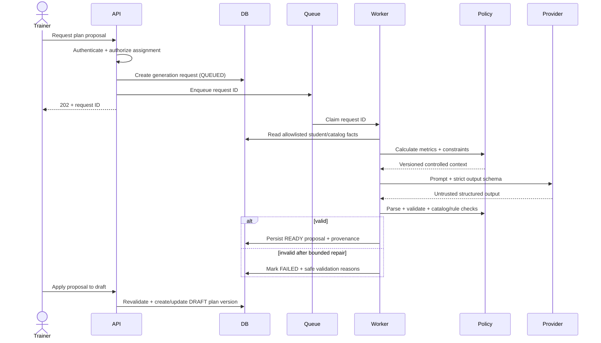

# AI Architecture

> **Propuesta histórica multietapa.** Para la implementación operativa de Fase 7 consultar [decisiones de propuestas asistidas](16-phase7-ai-proposals.md) y el código. La cola/Redis, el motor clínico de reglas, las correcciones y la narrativa mensual descritos aquí no se implementaron en Fase 7; este documento conserva opciones futuras y no reemplaza los contratos ni las migraciones reales.

## 1. Positioning

AI is a planning assistant and language layer. It is not a domain authority, data store, rules engine, medical system, or autonomous coach.

The safest useful split is:

- application code selects facts and calculates metrics;
- deterministic policies enforce hard constraints;
- AI proposes and explains;
- a trainer decides;
- normal application services persist approved actions.

Manual plan creation and all workout execution must continue when AI, Redis, or the provider is unavailable.

## 2. Trust Boundaries

AI must never receive:

- database credentials or query tools;
- arbitrary SQL or ORM access;
- access/refresh tokens or password data;
- unrelated students' data;
- unrestricted trainer-only notes;
- raw audit logs;
- permission to call application mutation endpoints;
- a tool that marks sets/sessions complete;
- a tool that approves or activates plans.

Phase 3 changed plans to reusable organization-owned programs and made student assignment explicit. A later AI proposal may be targeted to a student for context, but applying it can affect only a trainer-controlled draft version; even after publish, it must not create or replace the student's `StudentPlanAssignment` without a separate trainer command.

Provider output starts as untrusted `unknown`. It becomes a proposal only after parsing and validation.

## 3. End-to-End Generation Flow



## 4. Controlled Context Builder

The context builder is an application service with a versioned allowlist. It uses explicit scoped query functions and produces a typed DTO. The provider cannot ask for more information dynamically in the initial release.

Proposed context sections:

```ts
type PlanGenerationContextV1 = {
  contextVersion: "plan-context.v1";
  student: {
    goal: TrainingGoal;
    secondaryGoals: TrainingGoal[];
    experienceLevel: ExperienceLevel;
    trainingFrequencyPerWeek: number;
    availableDays: Weekday[];
    approximateSessionMinutes: number;
    activityLevel: ActivityLevel;
    externalActivities: Array<{
      activityType: string;
      weeklyFrequency: number | null;
      typicalDurationMinutes: number | null;
      intensity: "LOW" | "MODERATE" | "HIGH" | null;
    }>;
  };
  constraints: Array<{
    reference: string;
    type: "LIMITATION" | "DECLARED_INJURY" | "RECURRING_DISCOMFORT";
    bodyRegion: BodyRegion | null;
    description: string;
    planningInstruction: string | null;
  }>;
  calculatedSignals: {
    period: { from: string; to: string };
    adherencePercent: number | null;
    participationPercent: number | null;
    completedWorkouts: number;
    partialWorkouts: number;
    averageSessionRpe: number | null;
    discomfortCountsByRegion: Record<string, number>;
    recentExercisePerformance: RecentExercisePerformance[];
  };
  approvedExerciseCatalog: Array<{
    id: string;
    name: string;
    primaryMuscleGroup: string;
    equipment: string[];
    difficulty: ExerciseDifficulty;
    performanceMode: "WEIGHT_REPS" | "REPS_ONLY";
    loadEntryConvention: string | null;
    contraindicationTags: string[];
  }>;
  trainerIntent: {
    planningHorizonWeeks: number;
    focus: string | null;
    requestedTemplateCount: number | null;
  };
};
```

Minimization rules:

- use an opaque request-scoped student reference, not name or email;
- omit exact birth date; send age band or age only if required and approved;
- do not send free-text trainer notes by default;
- normalize recent performance into bounded summaries rather than complete history;
- include only catalog exercises eligible for the current equipment/context;
- bound every array and text field;
- store a context hash and context schema version; a minimized encrypted snapshot may be retained only until its explicit `purgeAt`, initially 30 days.

## 5. Deterministic Preprocessing

Before provider invocation, application code calculates:

- adherence and participation;
- number of completed and partial sessions;
- average and trend of session RPE;
- set volume and progression by exercise;
- estimated strength where valid;
- discomfort counts by region and rolling period;
- available training days and session duration feasibility;
- active constraints;
- eligible exercise IDs.

The model receives values and definitions. It does not calculate them from raw logs.

## 6. Proposal Schema

The provider must return strict JSON matching a versioned schema. A simplified shape:

```ts
type PlanProposalV1 = {
  schemaVersion: "plan-proposal.v1";
  title: string;
  summary: string;
  assumptions: string[];
  constraintsConsidered: Array<{
    constraintReference: string;
    handling: string;
  }>;
  warnings: Array<{
    code: string;
    message: string;
  }>;
  workouts: Array<{
    name: string;
    estimatedDurationMinutes: number;
    rationale: string;
    exercises: Array<{
      exerciseId: string;
      sets: number;
      minRepetitions: number;
      maxRepetitions: number;
      intensityMode: "RIR" | "RPE" | "NONE";
      targetRir: number | null;
      targetRpe: number | null;
      restSeconds: number;
      suggestedLoadMinKg: string | null;
      suggestedLoadMaxKg: string | null;
      trainerNoteSuggestion: string | null;
      rationale: string;
    }>;
  }>;
};
```

The production schema must use `.strict()` and explicit length/range bounds.

## 7. Validation Pipeline

Validation is layered and fails closed:

1. Decode provider response as JSON.
2. Validate exact schema and reject unknown fields.
3. Enforce size, count, numeric, and text limits.
4. Resolve every `exerciseId` against the supplied approved catalog.
5. Reject inactive or non-AI-eligible exercises.
6. Validate repetitions, set counts, RIR/RPE, rest, and load ranges.
7. Ensure intensity fields match intensity mode.
8. Ensure workout count does not exceed available-day/frequency limits and each estimated duration fits the profile. Exact dated scheduling remains a trainer action outside AI.
9. Run deterministic constraint rules and contraindication tags.
10. Reject diagnostic language and prohibited claims.
11. Attach warnings requiring trainer attention.
12. Persist only the validated normalized proposal.

A bounded repair attempt may send schema errors back to the same provider once. Business-rule failures should not be silently repaired beyond a configured count; show the trainer a safe failure and allow retry.

Safety rules are an application-owned, versioned catalog with two severities:

- `BLOCK`: non-overridable. The proposal cannot become ready while conflicting content remains. The result tells the trainer that qualified review is required; AI does not invent an adaptation.
- `REVIEW_REQUIRED`: the proposal may be applied only into a draft. Draft validation then persists the finding with rule code/version and draft revision/content hash; publishing requires explicit trainer acknowledgement with rationale.

Free-form contraindication tags are normalized against this catalog before validation. An acknowledgement never changes a declared constraint or converts a block into a warning. Any relevant draft mutation invalidates the finding/acknowledgement; publish re-runs all rules against the current draft revision.

## 8. Hard Constraints and Soft Signals

Hard constraints are enforced outside the model. Examples:

- all exercise IDs must exist and be allowed;
- plan cannot exceed configured frequency or unavailable days;
- a non-overridable safety block cannot be bypassed; a reviewable warning requires a structured, audited trainer acknowledgement;
- prescribed RIR/RPE and repetition values must remain within accepted ranges;
- active versions cannot be modified;
- no version becomes active without trainer publish action.

Soft signals inform recommendations but do not force outcomes. Examples:

- high recent average session RPE;
- repeated partial workouts;
- falling adherence;
- stable or rising load progression;
- recurring discomfort reports;
- high external sport activity.

AI should explain how it considered soft signals. It must not claim causality.

## 9. Adaptation Policy

Future generation uses finalized facts and deterministic signals. It does not automatically rewrite an active plan.

Example application-generated signal:

```json
{
  "code": "REPEATED_RIGHT_KNEE_DISCOMFORT",
  "periodDays": 28,
  "sessionCount": 3,
  "maximumReportedIntensity": 5,
  "message": "Right knee discomfort was reported after 3 sessions in the last 28 days."
}
```

For reviewable signals, AI may propose reduced exposure, eligible alternatives, or trainer review. A hard safety condition blocks the conflicting proposal and directs the trainer to qualified review. AI may not diagnose the knee or assert that an exercise caused an injury.

## 10. Trainer Review UX Requirements

The proposal review must show:

- “AI suggestion” label and generation timestamp;
- source period for metrics;
- active constraints considered;
- assumptions and unresolved information;
- warnings before plan content;
- per-exercise rationale on demand;
- suggested load visually distinct from actual historical load;
- invalidated exercises if the catalog changed after generation;
- accept into draft, reject, and regenerate actions;
- no direct publish action from the raw proposal.

Applying a proposal re-runs current assignment and validation because profile, constraints, or catalog may have changed while generation was in flight. Reviewable findings are attached to the resulting draft and block publish until acknowledged; hard blocks prevent application of conflicting content. V1 applies a selected subset at most once into one draft; retries return the existing application result rather than duplicating exercises.

## 11. Provider Abstraction

Domain-facing port:

```ts
interface StructuredAiProvider {
  generateStructured<TInput, TOutput>(request: {
    purpose: "PLAN_PROPOSAL" | "MONTHLY_NARRATIVE";
    promptVersion: string;
    input: TInput;
    outputSchema: unknown;
    timeoutMs: number;
  }): Promise<{
    output: unknown;
    provider: string;
    model: string;
    requestReference: string | null;
    usage: { inputTokens: number | null; outputTokens: number | null };
  }>;
}
```

Provider SDK details remain in adapters. Switching providers must not change proposal/domain schemas.

## 12. Monthly Narrative Flow

1. Analytics creates and persists a deterministic monthly metric snapshot.
2. Narrative input contains only those metrics, their labels, period, and `insufficientData` markers.
3. Provider returns a constrained narrative AST composed of allowlisted sentence types; every quantitative/comparative clause contains metric-key placeholders rather than arbitrary prose.
4. Validator rejects unknown nodes/placeholders, unsupported metric references, literal quantities, and quantitative language outside typed clauses.
5. Application code renders placeholders from the immutable metric snapshot and stores claim-to-metric references.
6. UI always displays source metrics with the rendered narrative and AI provenance.

If generation fails, the metric report remains complete and usable.

## 13. Prompt Injection and Untrusted Text

Student comments, exercise instructions, and trainer intent are data, not instructions. Prefer structured intent; omit free text that is not needed, delimit included text, and bound its length. The provider has no tools, so an injection cannot directly query or mutate the application. AI-generated prose is not fed into future prompts by default. Evaluation tests behavioral invariants as well as schema validity.

## 14. Audit and Observability

For every generation record:

- organization, student, requester, purpose;
- context schema version and hash;
- prompt version;
- provider and model;
- generation status, attempts, latency, and token usage;
- validation errors and policy warnings;
- proposal schema version;
- trainer apply/reject action and timestamp;
- each application actor, selected proposal items, validation/rule version, and resulting draft version;
- each publish-time warning acknowledgement, actor, rationale, finding revision/hash, and resulting active version.

Do not write raw sensitive context or provider response to ordinary logs. Access to stored AI records requires either an active organization admin or a current active student assignment; being the original requester is not sufficient after revocation. JSON fields have versioned runtime schemas and data classifications, and purge jobs remove expiring context/provider artifacts by `purgeAt`.

Because database request creation and queue enqueue are separate, a reconciliation job periodically enqueues eligible `QUEUED` rows that have no active BullMQ job. The database status machine and deterministic request fingerprint prevent duplicate concurrent work; Redis is never the source of truth.

## 15. Evaluation Before Release

Maintain a de-identified fixture suite covering:

- beginner and experienced students;
- every goal type;
- low and high weekly frequency;
- short session duration;
- external sport load;
- active limitations and declared injuries;
- repeated discomfort;
- poor adherence and repeated partial sessions;
- no recent data;
- inactive/invalid exercise references;
- prompt-injection strings in notes;
- provider malformed JSON and timeout.

Release gates include schema pass rate, hard-rule violation rate of zero after validation, unsupported-exercise rate of zero after validation, warning recall on fixtures, and trainer-rated usefulness. Prompt/model changes are versioned and can be rolled back.
